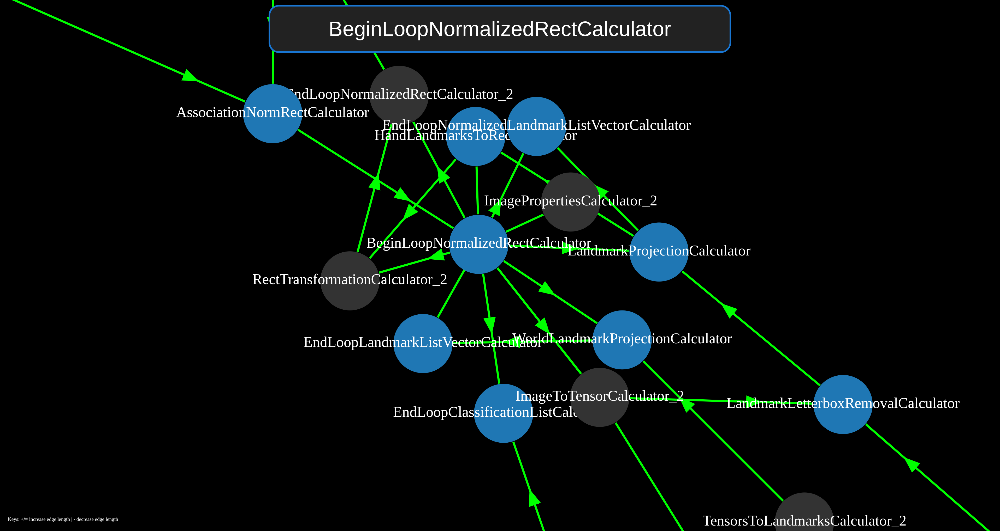

# MediaPipe Pipeline Analysis

+ `pipeline_parser.py` generates json (and other formats) files that extract the MediaPipe graph details, static and data flow details. 

+ Visualizing the flow graph with interactive focusing features is also available: 

[See here to generate those dynamic views as above](analysis/flow_graph_visualization.md).

Unlike the screenshot above, you can focus it on only one node's clique of immediate connections by hovering and/or by the search box at the top.