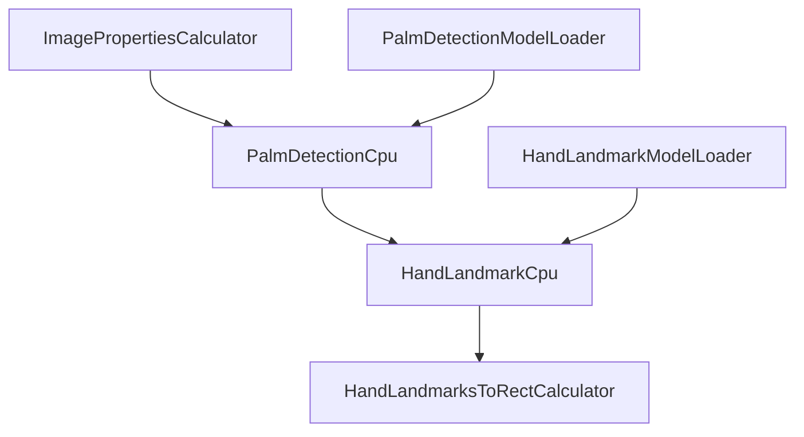

# MediaPipe Hand Pipeline - Visual Flowchart Diagram

**What this document contains:**
This document provides a Mermaid flowchart diagram showing the visual flow between calculators in the MediaPipe hand tracking pipeline. Use this to see the pipeline structure and data flow relationships as a visual diagram that can be rendered in web browsers and documentation tools.

**How this connects to other documents:**
- **[pipeline_execution_order_and_operations.md](pipeline_execution_order_and_operations.md)** provides detailed technical specifications for each calculator shown in this diagram
- **[all_calculators_and_cpp_sources.md](all_calculators_and_cpp_sources.md)** provides C++ source locations for every calculator shown here
- **[calculator_functional_categories.md](calculator_functional_categories.md)** groups these same calculators by functional purpose

**Generated by:** `call_graph_visualizer.py`

---

